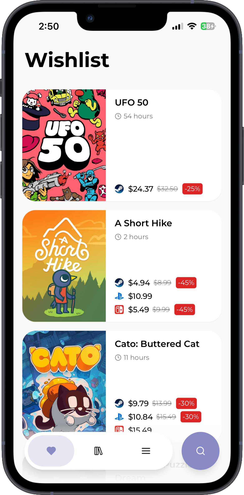
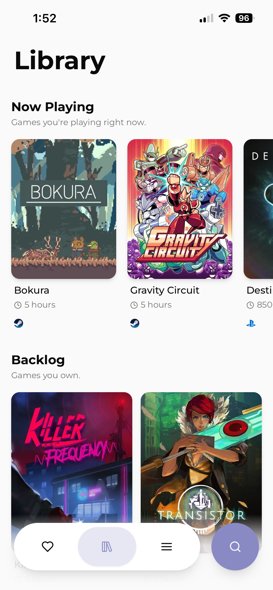
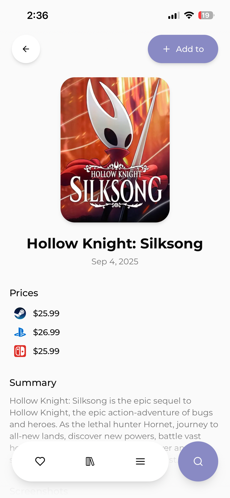
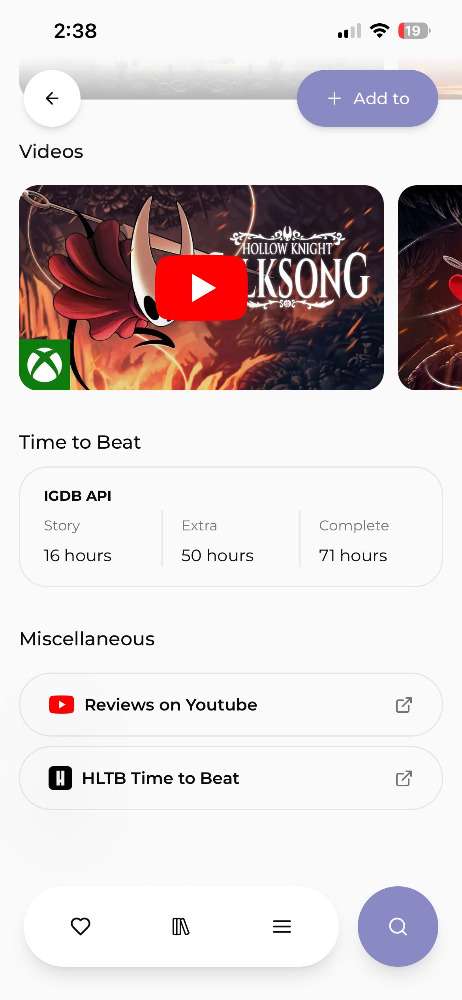
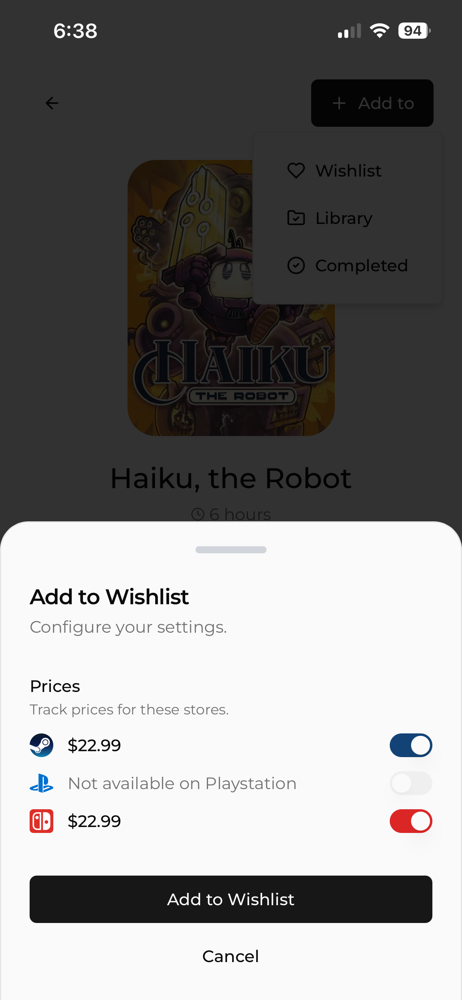
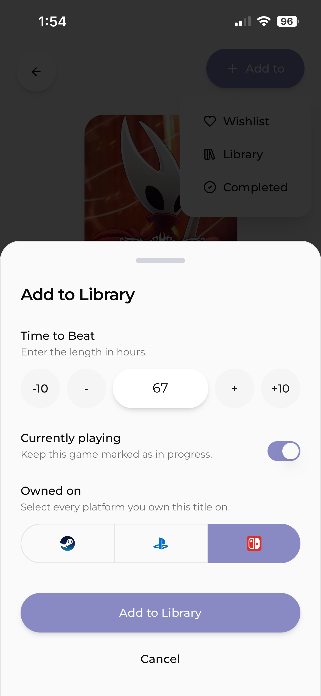

# Playward

A full-stack video game backlog manager and price tracker. Search for games, organize your wishlist and library, track time-to-beat estimates, and monitor prices across Steam, PlayStation, and Nintendo.

#### NOTES:

- Playward is still actively being worked on — expect frequent updates, and occasional breaking changes.
- The best experience is via the PWA: install it and add it to your Home Screen. (Add to Home Screen)

## Features

- **Game Search** — Powered by IGDB with a custom ranking algorithm that weighs recency, ratings, and content completeness
- **Backlog Management** — Organize games across Wishlist, Library, and Completed states with "Now Playing" prioritization
- **Price Tracking** — Automated monitoring across Steam, PlayStation Store, and Nintendo eShop with support for discounts and subscription tiers (PS Plus Extra/Premium)
- **Time Estimates** — Track expected completion times to help manage your backlog
- **PWA Support** — Install on mobile for a native app-like experience
- **Google Sign-In** — Persistent, cross-device game lists

## Screenshots

	
	
	

	
	
	

	
	

## Architecture Highlights

- **Bayesian Ranking** — Search results are ranked using a multi-factor quality score: user/critic ratings (Bayesian averaged), release recency, community hype, and content completeness
- **Multi-Platform Price Scraping** — Custom parsers for Steam JSON API, PlayStation Store HTML (Apollo cache extraction), and Nintendo eShop pricing API
- **Scheduled Price Updates** — Cron jobs fetch and update pricing data across all platforms with error-resilient batch processing
- **Client-Side Navigation** — Custom navigation provider with global loading states and scroll position restoration for app-like UX
- **Rich Game Details** — Image carousels, embedded YouTube trailers, expandable descriptions, and real-time price comparisons
- **Server Actions** — Type-safe data mutations with Next.js server actions and cache invalidation via `revalidateTag`

## Tech Stack

| Layer      | Technology                                                     |
| ---------- | -------------------------------------------------------------- |
| Framework  | Next.js 15 (App Router) + TypeScript                           |
| Database   | PostgreSQL + Prisma ORM                                        |
| Auth       | NextAuth.js (Google OAuth)                                     |
| Styling    | Tailwind CSS + Shadcn/ui                                       |
| Game Data  | IGDB / Twitch API                                              |
| Price Data | Steam API, PlayStation Store, Nintendo eShop (scraping + APIs) |
| Hosting    | Vercel                                                         |
