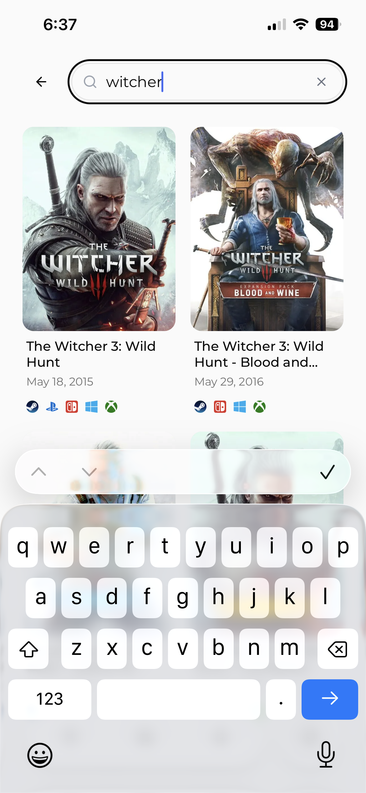
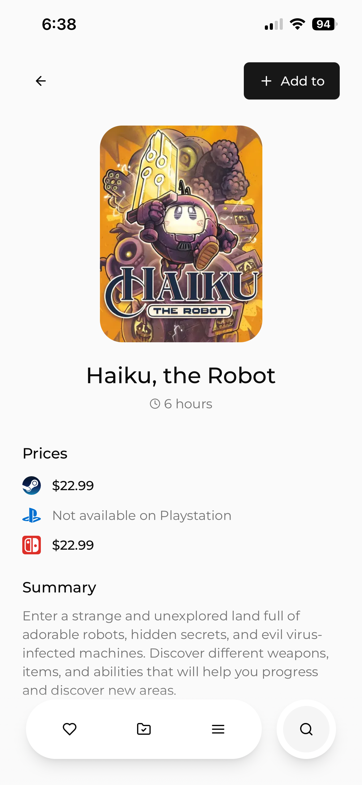

# Playward

Track the games you want to play, estimate how long they will take, and keep an eye on prices across major storefronts.

Playward is a focused backlog app: search for a game, add it to your wishlist or library, set a time estimate, and move it through to completion.

## Highlights

- Search and add games (powered by IGDB)
- Organize by status: Wishlist, Library, Completed
- Track time-to-beat with a per-game length estimate
- Monitor prices across supported platforms (Steam / Nintendo / PlayStation)
- Sign in with Google for a personal, persistent list

## Screenshots

	
	
	

	
	
	

## Built with

- Next.js (App Router) + TypeScript
- Prisma + PostgreSQL
- NextAuth (Google provider)
- Tailwind CSS + Radix UI primitives
- IGDB API (game data)
- Vercel (hosting)
