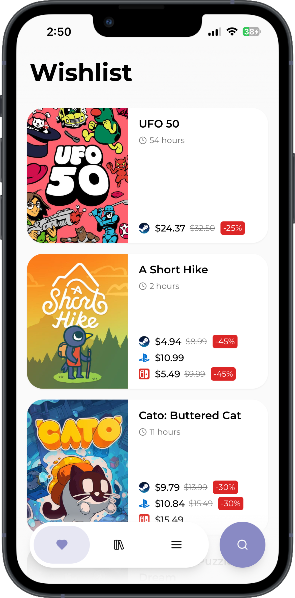
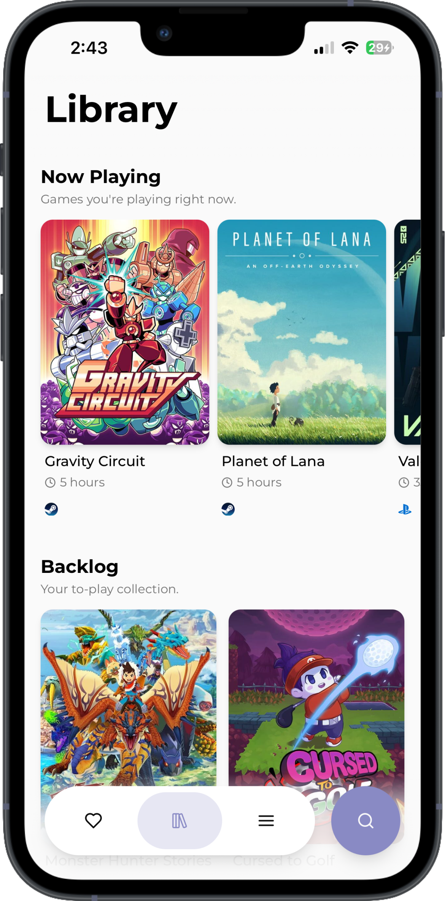
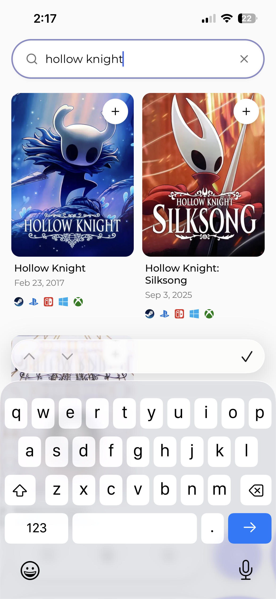
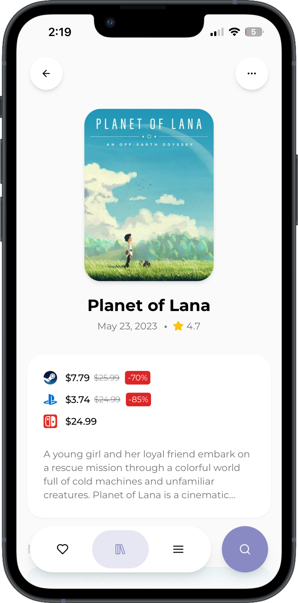
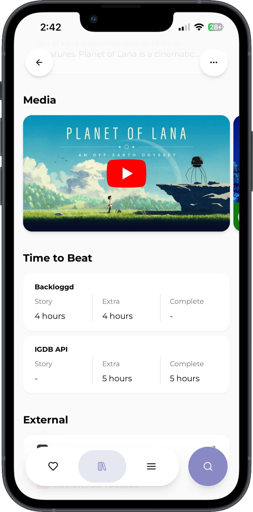
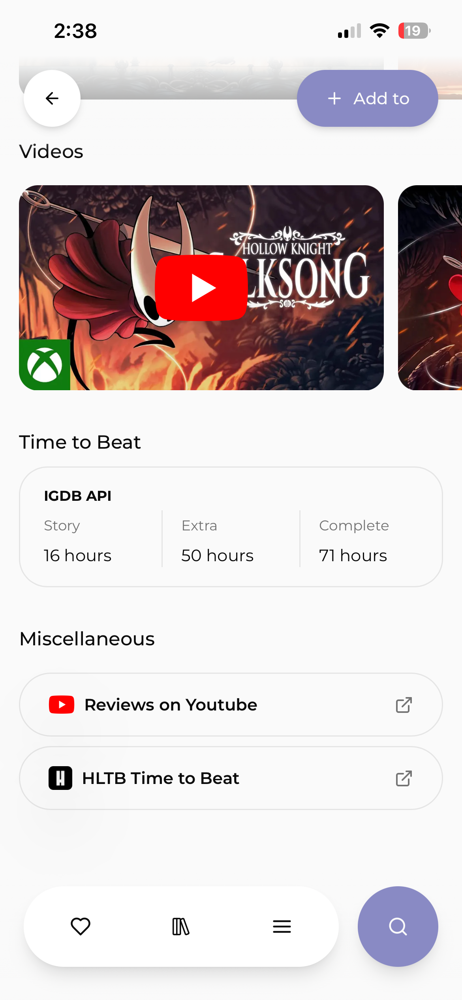
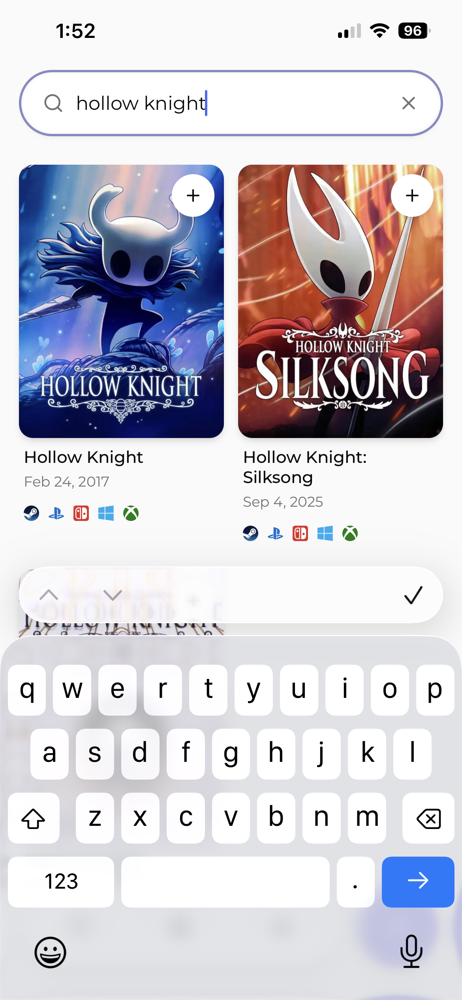
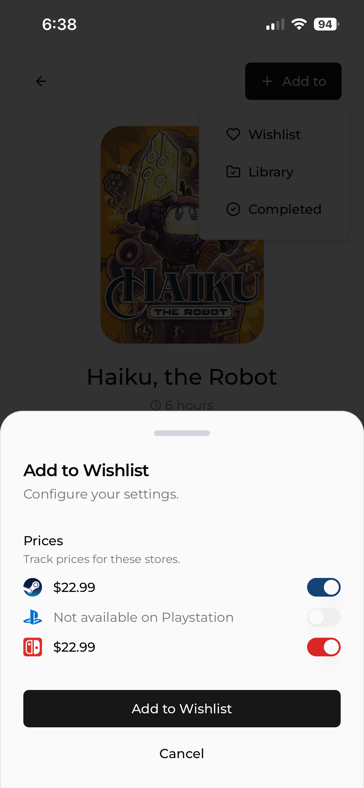
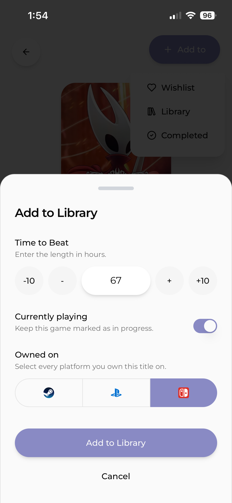

# Playward

Playward is a full-stack video game wishlist and backlog manager built with Next.js. It lets you discover games, organize them into personal lists, compare store pricing across platforms, and access game playtime estimates and Steam review snapshots.

#### NOTES:

- Playward is feature complete, but is still being worked on — expect frequent updates!
- The best experience is via PWA: install it and add it to your Home Screen.

## Features

- Search and discovery powered by IGDB
- Quality-ranked results using ratings, recency, hype, and metadata completeness
- Personal game lists for Wishlist, Library and Completed
- "Now Playing" prioritization for active games
- Price tracking across Steam, PlayStation Store, and Nintendo eShop
- Store-aware pricing metadata, including PlayStation Plus tiers
- Time-to-beat estimates on game detail pages
- Steam review summary pages with cached review excerpts
- Search history for signed-in users
- Mobile-friendly PWA install support

## Screenshots

  
  
  

  
  
  

  
  
  

## Architecture Highlights

- Quality-ranked IGDB search with recency, ratings, hype, and metadata completeness
- Multi-platform pricing pulled from Steam, PlayStation Store, and Nintendo eShop
- Daily background refresh flows for pricing and curated discovery shelves
- Server actions with cache tags and `unstable_cache` for fast repeat reads
- Middleware-backed auth gating for private lists, search history, and user data
- App-like navigation with global loading states, scroll restoration, and PWA support

## Tech Stack

| Layer      | Technology                                                 |
| ---------- | ---------------------------------------------------------- |
| Framework  | Next.js 15 App Router + React 18 + TypeScript              |
| Database   | PostgreSQL + Prisma ORM                                    |
| Auth       | Auth.js / NextAuth with Google OAuth                       |
| Styling    | Tailwind CSS + Radix UI                                    |
| Game Data  | IGDB / Twitch API                                          |
| Price Data | Steam API, PlayStation Store scraping, Nintendo eShop APIs |
| Hosting    | Vercel                                                     |
